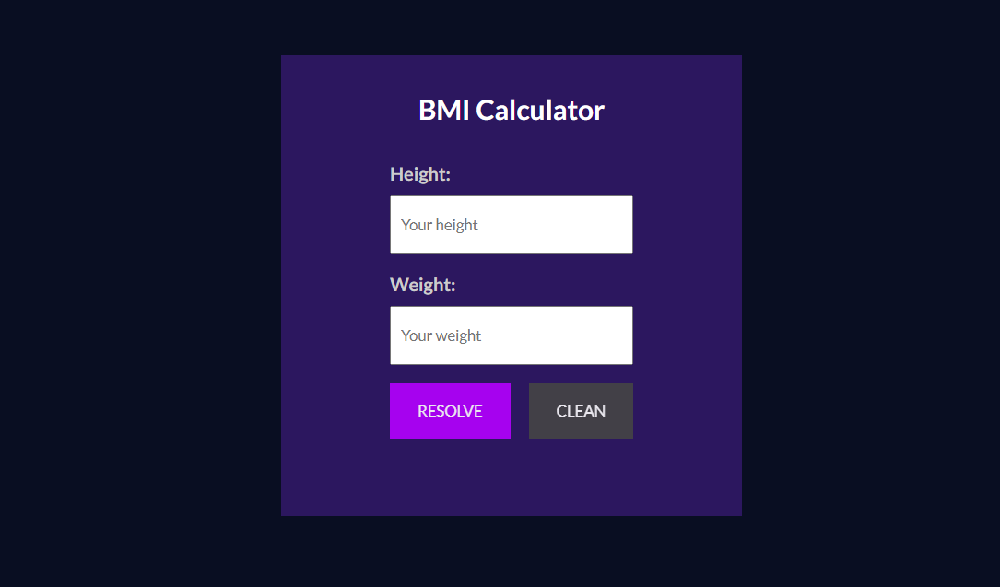
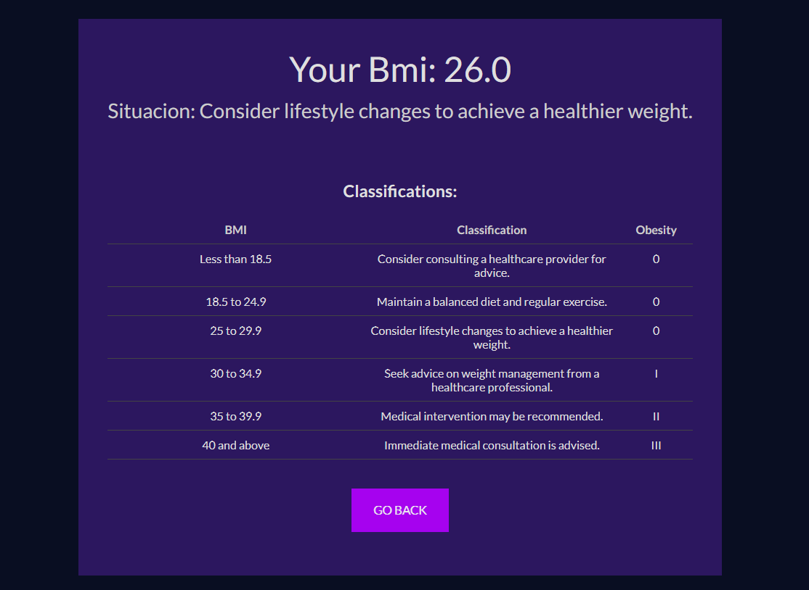

# Calculadora IMC / BMI Calculator

PT-BR: O projeto feito para calcular o imc do usuário.

EN: A project with the intent of calculating the user's bmi.

---

## Componentes / Components

PT-BR:

- Calculadora IMC
- Botão
- Tabela IMC

EN:

- BMI Calculator
- Button
- BMI Table

---

## Como usar / How to run

**Pré-requisitos / Pre-requisites**
- [Node.js](https://nodejs.org/en)

**1. Clone o repositório / Clone the repository**
```
git clone https://github.com/fargila/atila-franca-estudos
```

**2. Abra a pasta em uma IDE e instale as dependências / Open the folder in an IDE and install the dependencies**
```
npm install
```

**3. Navegue até o diretório do projeto / Navigate into the project directory**
```
cd Semana-09/Project: BMI Calculator/
```

**4. Abra o terminal integrado e execute o seguinte comando para iniciar o servidor / Open the integrated terminal and execute the following command to start the server**
```
npm run dev
```

**5. O projeto estará rodando no endereço seguinte / The project will be running in the following URL**
```
http://localhost:5173
```

---

## Capturas de tela / Screenshots

### Desktop:



<br>

---

### Autor / Author
Átila França do Nascimento <br>
<br>
October 2024
