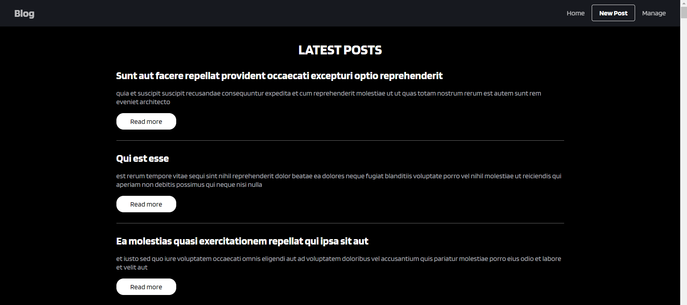
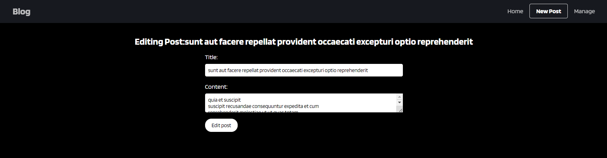
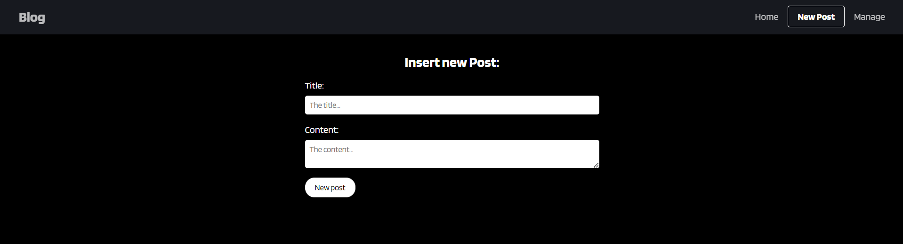
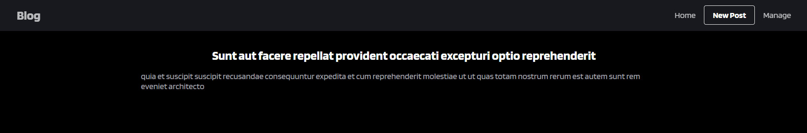

# Blog

PT-BR: Projeto de estudo para construir um site de informações com a API do json, mostrando os conceitos básicos para criar um blog.

EN: Project with the intent of buildinf a news site using the JSON API, showing the basic concepts on how to create a blog.

---

## Componentes / Components

PT-BR:

- Página principal
- Página de administração
- Página de edição de posts
- Página de mais sobre o post
- Página para um novo post

EN:

- Home
- Admin page
- Edit post page
- Read more post page
- New Post page

---

## Como usar / How to run

**Pré-requisitos / Pre-requisites**
- [Node.js](https://nodejs.org/en)

**1. Clone o repositório / Clone the repository**
```
git clone https://github.com/fargila/atila-franca-estudos
```

**2. Abra a pasta em uma IDE e instale as dependências / Open the folder in an IDE and install the dependencies**
```
npm install
```

**3. Navegue até o diretório do projeto / Navigate into the project directory**
```
cd Semana-09/Project: Blog/
```

**4. Abra o terminal integrado e execute o seguinte comando para iniciar o servidor / Open the integrated terminal and execute the following command to start the server**
```
npm run dev
```

**5. O projeto estará rodando no endereço seguinte / The project will be running in the following URL**
```
http://localhost:5173
```

---

## Capturas de tela / Screenshots

### Desktop:

**Home / Página principal**

<br>

**Edit post page / Página de edição**

<br>

**Add new post page / Página para adicionar um novo post**

<br>

**About the post page / Página do conteúdo do post**

<br>

---

### Autor / Author
Átila França do Nascimento <br>
<br>
October 2024
