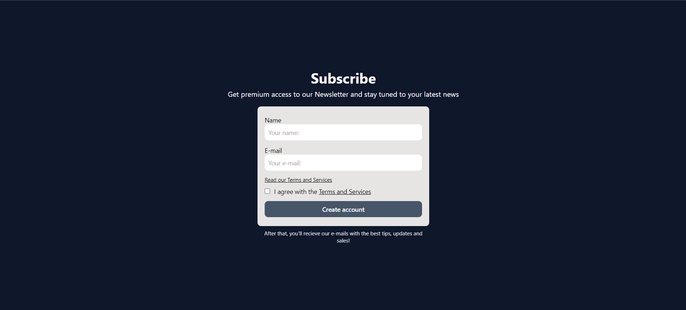

# Formulário para e-mail contínuos / Newsletter Form 

PT-BR: Página para um formulário básico para o usuário se enscrever num programa de mensagens virtuais.

EN:A basic form page for users to sign up for a newsletter course.

---

## Componentes / Components

PT_BR:

- Formulário

EN:

- Form

---

## Como usar / How to run

**Pré-requisitos / Pre-requisites**
- [Node.js](https://nodejs.org/en)

**1. Clone o repositório / Clone the repository**
```
git clone https://github.com/fargila/atila-franca-estudos
```

**2. Abra a pasta em uma IDE e instale as dependências / Open the folder in an IDE and install the dependencies**
```
npm install tailwindcss postcss autoprefixer

[tailwind.config.js]
/** @type {import('tailwindcss').Config} */
module.exports = {
  content: ['./index.html', './src/**/*.{html,js,jsx,ts,tsx}'],
  theme: {
    extend: {},
  },
  plugins: [],
}

[postcss.config.js]
export default {
    plugin: {
        tailwindcss: {},
        autoprefixer: {},
    }
}

[src/styles/input.css]
@tailwind base;
@tailwind components;
@tailwind utilities;

npx tailwindcss -i ./src/styles/input.css -o ./src/styles/output.css --watch

[index.html]
<link href="./src/styles/output.css" rel="stylesheet"/>
```

**3. Navegue até o diretório do projeto / Navigate into the project directory**
```
cd Semana-09/Project: Newsletter/
```

**4. Abra o terminal integrado e execute o seguinte comando para iniciar o servidor / Open the integrated terminal and execute the following command to start the server**
```
npm run dev
```

**5. O projeto estará rodando no endereço seguinte / The project will be running in the following URL**
```
http://localhost:5173
```

---

## Capturas de tela / Screenshots

### Desktop:


<br>

---

### Autor / Author
Átila França do Nascimento <br>
<br>
October 2024
