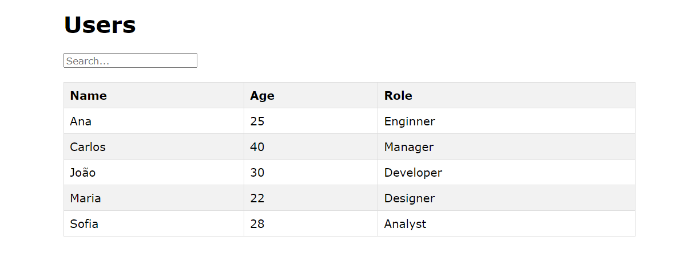

# Tabela Ordenável / Ordenatable Table

PT-BR: Mini-Projeto com uma tabela com dados ordenados por nome em ordem alfabética (basta clicar na parte títular). Ademais, um sistema de busca baseado em nome e profissão.

EN: Mini-project with a table containing data sorted by name in alphabetical order (just by clicking on the header of the table). Additionally, a search system based on name and role.

---

## Componentes / Components

PT-BR:
- Barra de pesquisa
- Tabela titular
- Tabela de linhas

EN:
- Search Bar
- Table Header
- Table Row

---

## Como usar / How to run

**Pré-requisitos / Pre-requisites**
- [Node.js](https://nodejs.org/en)

**1. Clone o repositório / Clone the repository**
```
git clone https://github.com/fargila/atila-franca-estudos
```

**2. Abra a pasta em uma IDE e instale as dependências / Open the folder in an IDE and install the dependencies**
```
npm install
```

**3. Navegue até o diretório do projeto / Navigate into the project directory**
```
cd Semana-09/Project: Ordentable Table/
```

**4. Abra o terminal integrado e execute o seguinte comando para iniciar o servidor / Open the integrated terminal and execute the following command to start the server**
```
npm run dev
```

**5. O projeto estará rodando no endereço seguinte / The project will be running in the following URL**
```
http://localhost:5173
```

---

## Capturas de tela / Screenshots

### Desktop:


<br>

---

### Autor / Author
Átila França do Nascimento <br>
<br>
October 2024
